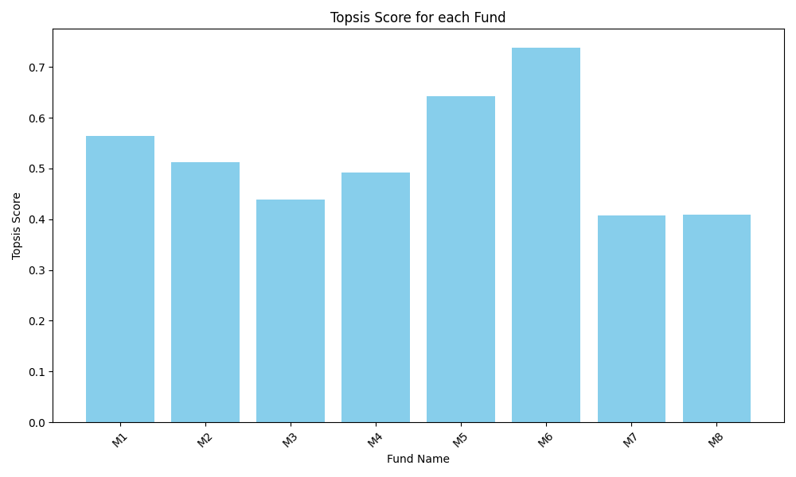

# Assignment - Topsis
Submitted by: **Devansh Wadhwani**
Roll Number: **102303631**

Type: **Package Implementation**

## Overview
This project implements the Topsis (Technique for Order of Preference by Similarity to Ideal Solution) algorithm as a Python package. It takes a dataset, weights, and impacts as input and produces a ranking of the alternatives.

## Methodology
The TOPSIS method is based on the concept that the chosen alternative should have the shortest geometric distance from the positive ideal solution (PIS) and the longest geometric distance from the negative ideal solution (NIS).

### Steps Involved:
1.  **Normalization of the Decision Matrix**:
    The values in the decision matrix are normalized to bring them to a comparable scale.
    $$ r_{ij} = \frac{x_{ij}}{\sqrt{\sum_{i=1}^{m} x_{ij}^2}} $$

2.  **Weighted Normalized Decision Matrix**:
    Each column of the normalized matrix is multiplied by its associated weight.
    $$ v_{ij} = w_j \times r_{ij} $$

3.  **Ideal Best and Ideal Worst Solutions**:
    -   **Ideal Best ($V^+$)**: Maximum value for beneficial attributes ('+') and minimum for non-beneficial attributes ('-').
    -   **Ideal Worst ($V^-$)**: Minimum value for beneficial attributes ('+') and maximum for non-beneficial attributes ('-').

4.  **Euclidean Distance Calculation**:
    Distance from the Ideal Best ($S_i^+$) and Ideal Worst ($S_i^-$) is calculated.
    $$ S_i^+ = \sqrt{\sum_{j=1}^{n} (v_{ij} - v_j^+)^2} $$
    $$ S_i^- = \sqrt{\sum_{j=1}^{n} (v_{ij} - v_j^-)^2} $$

5.  **Topsis Score Calculation**:
    The performance score is calculated as the ratio of the distance from the ideal worst solution to the total distance.
    $$ P_i = \frac{S_i^-}{S_i^+ + S_i^-} $$

6.  **Ranking**:
    Alternatives are ranked in descending order of their Topsis Score.

## Results
The algorithm was applied to the `data.xlsx` dataset using the following weights and impacts:
-   **Weights**: `1,1,1,1,1`
-   **Impacts**: `+,+,+,+,+`

### Result Table (First 5 Rows)
| Fund Name | P1   | P2   | P3  | P4   | P5    | Topsis Score | Rank |
| :---      | :--- | :--- | :-- | :--- | :---- | :---         | :--- |
| M1        | 0.84 | 0.71 | 6.7 | 42.1 | 12.59 | 0.5287       | 3    |
| M2        | 0.91 | 0.83 | 7.0 | 31.7 | 10.11 | 0.4716       | 4    |
| M3        | 0.79 | 0.62 | 4.8 | 46.7 | 13.23 | 0.4447       | 6    |
| M4        | 0.78 | 0.61 | 6.4 | 42.4 | 12.55 | 0.4499       | 5    |
| M5        | 0.94 | 0.88 | 3.6 | 62.2 | 16.91 | 0.5831       | 2    |

### Result Graph


## Installation and Usage
```bash
pip install Topsis-Devansh-102303631
```
```bash
topsis data.xlsx "1,1,1,1,1" "+,+,+,+,+" result.csv
```
